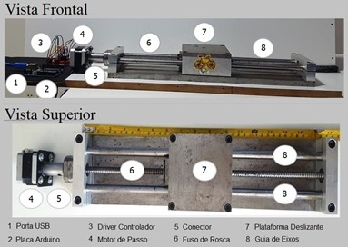

# GEDUSE
Low-Frequency Shake Table homemade of UnB - GDS - PPG Integridade

## Abstract
A mesa vibratória GEDUSE é um excitador eletromecânico do tipo mesa vibrante com a capacidade de realizar movimento unidirecional de amplitude e de baixa frequência controlados. A mesa vibratória GEDUSE é composto por dois elementos básicos: uma parte eletromecânica, uma parte microcontrolada. Fig. 1 apresenta as vistas frontal e superior dos elementos componentes da parte mecânica. E Fig. 2 apresenta os elementos componentes da parte microcontrolada. Basicamente, a GEDUSE é composta por (a) uma plataforma deslizante para realizar movimento translacional (b) acionada por um motor de passo, e (c) uma placa microcontrolada Arduino Uno + drive de motor de passo para codificar o movimento e acionar o motor de passo.

